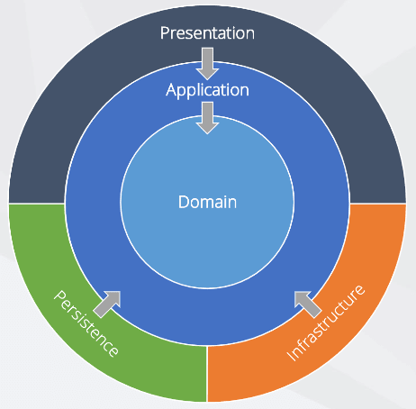
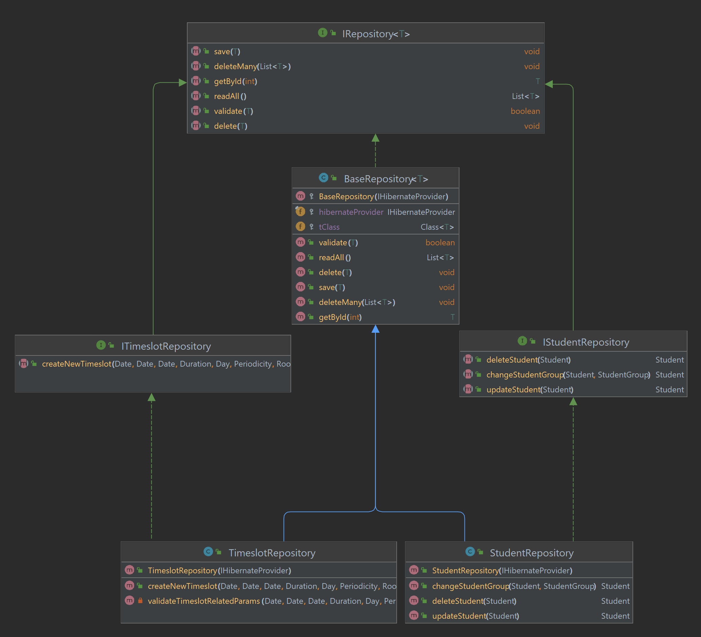
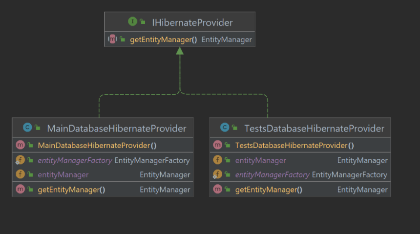

## Architecture

- [Architecture](#architecture)
  - [Overview](#overview)
      - [It encapsulates:](#it-encapsulates)
  - [Motivation](#motivation)
  - [Generic repository pattern](#generic-repository-pattern)
    - [Repositories](#repositories)
    - [Multiple database configuration environments](#multiple-database-configuration-environments)
    - [Validation](#validation)
    - [Dependency injection](#dependency-injection)
    - [Error handling](#error-handling)

### Overview

Our application utilizes Clean Architecture.

- Consists of 4 layers: `domain`, `application`, `infrastructure` and `presentation`.

Image by [Daniel Rusnok](https://dev.to/danielrusnok).

**1. Domain layer**
- contains the **core business logic** of the application.
##### It encapsulates: 
- the **entities** that describe the **main concepts and rules** of the business domain
- contains the **details neccesary about every concept (entity)** as well as **constraints** (such as validation logic) or the **relationships** between them
- contains the **domain - related exceptions** that can be thrown by the application for custom **error handling** in the `application` layer
- It is independent of the other layers 

**2. Application layer**

- references the `domain` layer.
- it **defines contracts for external dependencies such as** database **repositories**, email services or message brokers, for example interfaces of the needed repositories (data store) operations.
- **exposes services that implement the main use cases** of the application
- services are responsible for **orchestrating the operations of the domain entities and the communication with external dependencies such as repositories**, message brokers, etc through interfaces.

**3. Infrastructure layer**

- references the`application` layer (and implicitly the `domain` layer)
- **implements the interfaces defined in the `application` layer for** things like **repositories** and includes the code that **handles the communication with the database**, message brokers, etc.
- **defines the configuration of database interaction** using Hibernate and Java Persistence API (JPA)

**4. Presentation layer**

- references the `infrastructure` layer (and implicityly the `application` layer and `domain`)
- responsible for **handling user input and the graphical interface**.
- **utilizes the services from the `application` layer** to perform the main functionalities
- sets up the dependency injection for the application (for all layers it picks the implementation for every interface)

### Motivation

- the **isolation between bussiness logic** (services, domain entities) the **data access layer**(repositories) and **presentation** (GUI) **simplifies unit testing** (no need simulate the GUI or database interactions)
  - **services** can be **tested independent** of the database
  - **repositories** can be **tested independent** of the core bussiness logic
- **offers** better **separation of concerns** resulting in making the application **easier to maintain and extend**
- **improves code reusability** by utilizing dependency injection
- **provides a clear structure** to the application understood by all developers that used this architecture before

### Generic repository pattern

#### Repositories

- contains the generic interface **IRepository&lt;_TEntity_&gt;** that **defines generic methods** available for **working with any type of entity**
- has **BaseRepository&lt;_TEntity_&gt;** that **implements** the generic repository interface and contains the **implementation of the generic methods**
- to create a **new repository** a **new interface for that repo** is created that **will** only **register methods specific to that entity** 
    - for example IStudentsRepository that extends **IRepository&lt;_Student_&gt;**
    - will contain **methods specific** to the **student entity**
- the **implementation of the new repository** interface will **extend the BaseRepository&lt;_TEntity_&gt;** and will **implement the specific entity interface** methods
    - for example the implementation StudentsRepository will extend **BaseRepository&lt;_Student_&gt;** and implements IStudentsRepository
    - will contain the **implementation of the methods specific to student entity** and **will be able to use the generic methods** from the base repository

#### Multiple database configuration environments 

- the application **decouples** the database provider can be **configured** to use **different databases** based on **various** defined **environments** (production, test)
- the provider of communication to the database is Hibernate and the IHibernateProvider interface we created **allows multiple implementations of the database configuration**
- **supplied to any repository** using dependency injection **as part of the BaseRepository** constructor

#### Validation

- the save method is implemented in the BaseRepository and it **validates the entity** before saving it to the database
- **ensures every validation passes** before even attempting to save the entity to the database
- **uses the validators** registered in the domain layer **for every entity** that is to be persisted

#### Dependency injection

- the application uses dependency injection to **provide the implementation of the interfaces**used in the application
- the dependency injection is **set up in the Main class of the presentation layer**
- **allows switching between different implementations** of the same interface **without changing the inner code** that uses the interface
- **allows changing** things like **external dependencies** for database layer for example

#### Error handling

- the application handles errors **using the custom exceptions registered** in the domain layer
- **whenever an error occurs** in the domain layer **a custom exception is thrown** and **handled in the application layer or finally in the presentation layer** to display a popup to the user with the error message
  