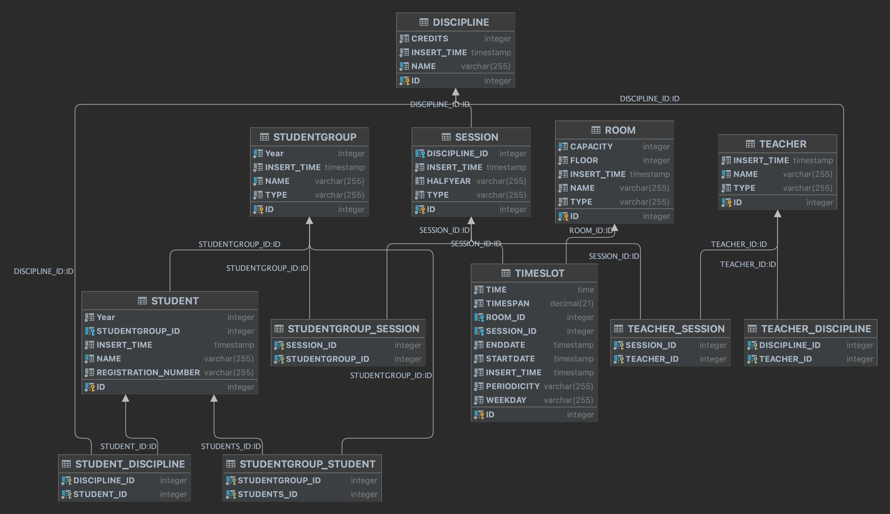

- [QSS2023](#qss2023)
- [SchoolTimetable](#schooltimetable)
  - [Project Requirements](#project-requirements)
    - [Description](#description)
    - [Phase 1 - Application Development](#phase-1---application-development)
    - [Phase 2 - Unit Testing](#phase-2---unit-testing)
    - [Phase 3 - Use of Assertions](#phase-3---use-of-assertions)
    - [Phase 4 - Documentation](#phase-4---documentation)
  - [Design \& Development (Phase 1)](#design--development-phase-1)
    - [Use Cases (based on the project requirements)](#use-cases-based-on-the-project-requirements)
    - [Programming language (Java)](#programming-language-java)
    - [Database interaction (the choice of an ORM)](#database-interaction-the-choice-of-an-orm)
    - [Database type (Apache Derby - embedded SQL)](#database-type-apache-derby---embedded-sql)
    - [Java Classes](#java-classes)
    - [GUI Framework (TODO: Roberta)](#gui-framework-todo-roberta)
    - [HTML Generator (TODO: Radu)](#html-generator-todo-radu)
    - [Architecture (separation of concerns \& modularization)](#architecture-separation-of-concerns--modularization)
    - [Putting all together (writing models in Java for Hibernate \& Apache Derby)](#putting-all-together-writing-models-in-java-for-hibernate--apache-derby)
    - [Presentation of GUI (technical)](#presentation-of-gui-technical)
    - [HTML table generator (technical)](#html-table-generator-technical)
    - [CI/CD](#cicd)
  - [Unit Testing - design \& implementation (Phase 2: libraries \& validators)](#unit-testing---design--implementation-phase-2-libraries--validators)
    - [Frameworks (Mokito \& JaCoCo)](#frameworks-mokito--jacoco)
    - [Hibernate Validartors (along with Jakarta)](#hibernate-validartors-along-with-jakarta)
  - [Use of Assertions (Phase 3: doing things a bit different)](#use-of-assertions-phase-3-doing-things-a-bit-different)
    - [Putting everything together (Validators \& pre/post conditions along with class/loop invariants)](#putting-everything-together-validators--prepost-conditions-along-with-classloop-invariants)
  - [Documentation (technical \& customer side) \& Specific Contribution (Phase 4)](#documentation-technical--customer-side--specific-contribution-phase-4)
    - [Technical documentation can be found here: TODO!](#technical-documentation-can-be-found-here-todo)
    - [User Guide Manual](#user-guide-manual)
    - [Contribution](#contribution)

# QSS2023
Quality of Software Systems

# SchoolTimetable

## Project Requirements

### Description

The goal of this project is to develop an application that assists users in creating and managing the timetable of a faculty. The application will provide support to users by offering a graphical interface that simplifies the manipulation of various entities involved in the timetable creation process.

### Phase 1 - Application Development

The program should support users in creating the timetable without actually generating it.
Consider the following elements:

- Students, organized by study years and groups
- Teachers
- Disciplines
- Class types (course/seminar/laboratory)
- Rooms
- Time slots
- There are certain restrictions to be applied:

Classes should only be scheduled on weekdays (Monday to Friday) between 8 AM and 8 PM.

Course classes should be scheduled only in course rooms due to the large number of students, while laboratory classes should be scheduled in laboratory rooms. There are no restrictions for seminar classes.

Course classes are taught to entire study years, while seminar/laboratory classes are taught to specific groups.
The program should assist the user by:

Providing a graphical interface (web-based or otherwise) that simplifies the manipulation of the entities involved.
Notifying the user of any issues such as broken restrictions, overlapping classes (e.g., two classes scheduled simultaneously in the same room or two classes taught by the same teacher at the same time), etc.

Generating HTML files for publishing the timetable, similar to the current faculty timetable.

Implementation should not rely on library functions, meaning the code must be written by the programmers. However, if a database server is used, it does not have to be implemented by the programmers.

Continuous communication with the beneficiary is necessary, allowing for clarification of requirements. Failure to understand the requirements and deliver a non-functional program will result in penalties.

Any programming language can be used, as long as it supports unit testing and mocking tools, as well as assertions specific to the language. These will be required in subsequent phases.

It is recommended to keep the program structure as simple as possible, without incorporating additional features beyond those mentioned above. The main goal is to create a working version of the program, even if it is not fully stable or error-free, to facilitate subsequent testing techniques.

### Phase 2 - Unit Testing

Requirements:

- Use unit testing tools to test the code developed during Phase 1.

Note that unit testing aims to determine if the tested module can handle incorrect input data from other modules or application I/O. Fixing errors is not required at this stage.

Strive for comprehensive code coverage during testing. For guidance on the conditions to be tested, refer to the provided courses.

Each module should be tested independently, and mocking will be used where necessary to simulate interactions with other modules.

### Phase 3 - Use of Assertions

Requirements:

- Insert assertions into the application code to verify the preconditions, postconditions, and invariants of the operations implemented in Phase 1. These assertions should be directly inserted into the application code and are separate from unit testing.
- If the programming language used lacks built-in assertions, a function or method must be written to achieve similar functionality.

### Phase 4 - Documentation

Requirements:

- Write documentation for Phases 1-3.
- There are no specific size requirements for the documentation, but it should clearly describe all the work done, including program design and implementation, a concise user manual, testing, and the use of assertions.
- Explicitly state the contributions of each team member.

## Design & Development (Phase 1)

### Use Cases (based on the project requirements)

TODO: Roberta & Radu

### Programming language (Java)
The following arguments made Java a suitable choice for developing an application to assist in creating and managing a faculty timetable:

1. Platform Independence: Java is a platform-independent language, which means that the application developed in Java can run on different operating systems without requiring significant modifications. This makes it easier to deploy the application on various platforms commonly used in educational institutions.

2. Rich Ecosystem and Libraries: Java has a vast ecosystem with a wide range of libraries and frameworks that can facilitate the development process. There are numerous libraries available for building graphical user interfaces (GUIs), handling web-based interfaces, managing databases, and implementing unit testing, which aligns with the project requirements.

3. Object-Oriented Programming (OOP) Paradigm: Java follows the OOP paradigm, which promotes modular and organized code structure. With the entities involved in the faculty timetable management system, such as students, teachers, disciplines, and rooms, an object-oriented approach can provide a clear and structured representation of these entities and their relationships, making it easier to manage and manipulate the data.

4. Robustness and Reliability: Java is known for its robustness and reliability. It has a strong type system, extensive error handling mechanisms, and automatic memory management through garbage collection. These features contribute to the stability and error-free operation of the application, which is essential for a project that involves managing critical information like a faculty timetable.

5. Community Support and Documentation: Java has a large and active community of developers, which means that there are ample resources available for learning, troubleshooting, and seeking assistance. The availability of comprehensive documentation, tutorials, and online forums can be beneficial for the development team, especially when encountering challenges or seeking best practices.

6. Integration Capabilities: Java offers excellent support for integrating with various systems and technologies. This can be advantageous when integrating the application with existing systems used by the faculty, such as databases, authentication systems, or other internal tools.

### Database interaction (the choice of an ORM)
Hibernate is a widely used Object-Relational Mapping (ORM) framework in the Java ecosystem, and it can provide several benefits for the project of creating and managing a faculty timetable. Here are some reasons why Hibernate might be a suitable choice:

1. Simplified Database Access: Hibernate simplifies database access by abstracting the low-level JDBC (Java Database Connectivity) code. It provides a high-level object-oriented approach to interact with the database, allowing developers to work with Java objects rather than writing complex SQL queries manually. This abstraction can significantly reduce the amount of boilerplate code required for database operations.

2. Object-Relational Mapping: The project involves managing various entities, such as students, teachers, disciplines, and rooms. Hibernate's core functionality lies in mapping Java objects to database tables, providing a seamless integration between the application's object model and the relational database schema. It simplifies the process of storing and retrieving objects from the database, handling relationships between entities, and managing database transactions.

3. Automatic Query Generation: Hibernate provides a Query Language called HQL (Hibernate Query Language), which is similar to SQL but operates on objects and their properties rather than database tables. It allows developers to write high-level, object-oriented queries, which Hibernate translates into appropriate SQL statements. This automatic query generation can save development time and reduce the chances of writing incorrect or inefficient SQL queries manually.

4. Caching and Performance Optimization: Hibernate incorporates various caching mechanisms to improve performance. It offers a first-level cache (session cache) and a second-level cache (optional shared cache), which can reduce the number of database round-trips and enhance application responsiveness. Hibernate also provides optimization techniques like lazy loading and batch fetching to minimize unnecessary database queries.

5. Transaction Management: Hibernate integrates well with transaction management frameworks like Java Transaction API (JTA) and Java Persistence API (JPA). It supports declarative transaction demarcation, ensuring ACID (Atomicity, Consistency, Isolation, Durability) properties for database operations. This simplifies the management of database transactions and helps maintain data integrity.

6. Portability and Database Independence: Hibernate abstracts the underlying database-specific details, allowing developers to write database-agnostic code. It provides a consistent API that works across different database systems, reducing the effort required to switch databases or adapt the application to different environments. This portability can be beneficial if there is a need to support multiple database platforms or if the database technology used by the faculty changes in the future.

### Database type (Apache Derby - embedded SQL)

We have chosen Apache Derby as the database system to be used in conjunction with Hibernate because of the following:

1. Lightweight and Embedded Database: Apache Derby is a lightweight, open-source relational database management system (RDBMS) that can be embedded within the application itself. This means that the database can run within the same Java process as the application, eliminating the need for a separate database server installation and configuration. This simplicity of deployment can be advantageous for small-scale applications or scenarios where the database needs to be self-contained.

2. Java-Based: Apache Derby is implemented in Java and fully supports the Java Database Connectivity (JDBC) API. Since the project is being developed in Java, using Apache Derby ensures a seamless integration between the application and the database. It allows for native communication between Hibernate and Apache Derby, making it straightforward to leverage Hibernate's ORM capabilities.

3. Ease of Setup and Configuration: Apache Derby is known for its ease of setup and configuration. It provides a simple installation process, and the database can be started with minimal configuration effort. This can save time and reduce the complexity of the development environment setup.

4. Portability: Apache Derby is designed to be highly portable, compatible with various operating systems and Java platforms. This portability allows the application to be deployed on different environments without significant modifications, providing flexibility for potential deployment scenarios.

5. Good Performance: Apache Derby offers decent performance for small to medium-sized datasets. As an embedded database, it operates within the same Java process as the application, resulting in reduced network latency and improved data access speed. While it may not be as performant as larger-scale database systems in certain scenarios, it can still provide satisfactory performance for a faculty timetable management application.

6. Seamless Integration with Hibernate: Apache Derby has excellent compatibility with Hibernate. Hibernate provides a comprehensive set of features for mapping Java objects to Apache Derby tables, generating SQL queries, and managing transactions. By combining Apache Derby with Hibernate, developers can leverage the power of Hibernate's ORM capabilities and take advantage of its robust features, such as object-relational mapping, caching, and query optimization.

### Java Classes

### GUI Framework (TODO: Roberta)

### HTML Generator (TODO: Radu)

### Architecture (separation of concerns & modularization)

TODO: Cosmin (placeholder below for now)

The architecture of this project is designed using a layered architecture pattern, with several distinct layers responsible for different functionalities. Here's an overview of the proposed architecture:

**Presentation Layer**: This layer handles the user interface and interaction. It includes graphical interfaces (GUI) that allows users to interact with the application. The presentation layer communicates with the business layer to retrieve and display data, as well as to capture user input.

**Business Layer**: The business layer contains the core logic of the application. It is responsible for processing and manipulating the data, enforcing business rules, and coordinating interactions between different components. In this project, the business layer would handle tasks such as managing the timetable entities, validating inputs, applying restrictions, and generating notifications for issues or conflicts.

**Persistence Layer**: The persistence layer is responsible for interacting with the database and handling data storage and retrieval. It utilizes Hibernate as the Object-Relational Mapping (ORM) framework to map Java objects to the underlying Apache Derby database. This layer handles tasks like persisting entity objects, executing database queries, and managing transactions.

**Domain/Model Layer**: The domain or model layer represents the core entities and data structures of the application. It encapsulates the business logic and defines the relationships between different entities, such as students, teachers, disciplines, and rooms. This layer provides the foundation for the application's functionality and serves as the bridge between the business and persistence layers.

**Utilities/Supporting Components**: Apart from the main layers, there are additional supporting components and utilities. We have logging modules for capturing and logging application events, exception handling components for managing errors and exceptions, and configuration components for managing application settings.

The proposed architecture promotes separation of concerns and modularization, enabling easier maintenance, testing, and scalability. It allows for the independent development and testing of different layers, promoting code reusability and flexibility. Additionally, the use of Hibernate with Apache Derby provides a seamless integration between the business and persistence layers, simplifying database operations and ensuring data consistency.

### Putting all together (writing models in Java for Hibernate & Apache Derby)

Writing classes for Hibernate and Apache Derby using Java is relatively straightforward and follows standard object-oriented programming principles. Here's an overview of the process:

1. Entity Classes: To map Java objects to database tables, you'll need to create entity classes. These classes represent the entities in your application's domain model, such as students, teachers, disciplines, and rooms. Each entity class typically corresponds to a table in the database.

2. Annotations or XML Mapping: Hibernate supports two approaches for mapping entity classes to database tables: annotations and XML mapping files. Annotations provide a more concise and intuitive way to define mappings directly within the entity classes using annotations like @Entity, @Table, @Column, and others. Alternatively, XML mapping files can be used to define the mappings externally.

3. Define Relationships: If your entities have relationships, such as one-to-many, many-to-one, or many-to-many, you'll need to establish these relationships in your entity classes using Hibernate annotations or XML mappings. This involves defining fields or properties representing the relationships and annotating them appropriately.

4. Configuration: Hibernate requires configuration to connect to the database and specify other settings. You'll need to create a Hibernate configuration file (usually named hibernate.cfg.xml) that provides details like the database connection URL, driver class, username, password, and other configuration options.

5. Session Factory: The Session Factory is a central component in Hibernate that manages database connections and provides sessions for performing database operations. You'll need to create and configure a Session Factory instance using the Hibernate configuration.

6. CRUD Operations: With the entity classes and Hibernate set up, you can perform Create, Read, Update, and Delete (CRUD) operations using Hibernate APIs. Hibernate provides methods like save, get, update, and delete to interact with the database. These operations allow you to persist, retrieve, update, and delete entities.

7. Transactions: Hibernate supports transaction management for ensuring data integrity and consistency. You can use Java Transaction API (JTA) or Hibernate's built-in transaction management mechanisms to demarcate transaction boundaries and perform atomic operations.

8. Querying: Hibernate provides various options for querying the database. You can use Hibernate Query Language (HQL), a powerful object-oriented query language similar to SQL, or Criteria API, which allows you to build queries programmatically using a type-safe API.

9. Testing and Integration: It's crucial to test your classes and database interactions. You can write unit tests using frameworks like JUnit to verify the correctness of your Hibernate and Apache Derby code. Integration testing can be performed by running the application against a test database to ensure seamless interaction between Hibernate and Apache Derby.
    
TODO: Roberta & Radu

### Presentation of GUI (technical)
### HTML table generator (technical)

### CI/CD

We used GitHub CI/CD (Continuous Integration/Continuous Deployment) workflows and this helped us in the following ways:

1. Automation and Efficiency: GitHub CI/CD workflows automate the build, test, and deployment processes, reducing manual effort and increasing overall efficiency. With CI/CD, you can set up automated workflows that automatically trigger when changes are pushed to the repository. This ensures that builds are consistently performed, tests are executed, and deployments are initiated without requiring manual intervention.

2. Code Quality and Reliability: CI/CD workflows integrate various stages of the development process, including building, testing, and static code analysis. By incorporating these stages into the CI/CD pipeline, you can enforce code quality standards, identify potential issues, and catch bugs early in the development cycle. This helps maintain the reliability and stability of the faculty timetable management application.

3. Continuous Testing: CI/CD workflows facilitate continuous testing by automatically triggering test suites whenever changes are made to the codebase. This ensures that tests are executed regularly, helping detect regressions, integration issues, and other potential problems as soon as they arise. Continuous testing helps maintain the correctness of the application and enables faster feedback loops for developers.

4. Collaboration and Version Control: GitHub provides a collaborative platform that enables multiple team members to work on the same codebase and manage version control effectively. By utilizing CI/CD workflows within GitHub, you can ensure that every change to the repository is properly built, tested, and integrated. This reduces conflicts, improves collaboration, and helps maintain a clean and stable codebase.

5. Deployment Automation: CI/CD workflows can automate the deployment process, allowing for quick and reliable deployments of the faculty timetable management application. By defining deployment stages and incorporating deployment scripts or configuration files into the workflow, you can ensure that the application is deployed consistently across different environments. This streamlines the release process and minimizes the risk of deployment errors.

6. Visibility and Traceability: GitHub CI/CD workflows provide clear visibility into the status and progress of the build, test, and deployment processes. You can view detailed logs, artifacts, and reports generated during each workflow run. This visibility helps track the history of changes, diagnose issues, and trace back to specific commits or changesets, facilitating troubleshooting and debugging.

7. Integration with Other Tools and Services: GitHub CI/CD workflows can be integrated with various tools and services, such as code coverage tools, static code analysis tools, and deployment services. This allows you to incorporate additional checks, generate reports, and deploy the application to different environments seamlessly.

## Unit Testing - design & implementation (Phase 2: libraries & validators)

### Frameworks (Mokito & JaCoCo)

**Mockito** is a popular and widely used testing library in the Java ecosystem making it a suitable choice because of the following:

1. Simplicity and Ease of Use: Mockito provides a simple and intuitive API that makes it easy to create mock objects and define their behavior. It has a clear and concise syntax, allowing developers to write readable and maintainable test code. Mockito's focus on simplicity makes it accessible to both experienced and novice developers.

2. Mocking Dependencies: In the project, there may be dependencies on external components or services that are not available or not desirable to use during testing. Mockito excels at creating mock objects that simulate the behavior of these dependencies. By mocking these dependencies, you can isolate the code under test and focus on testing specific units without worrying about the behavior of external components.

3. Flexibility and Versatility: Mockito provides a wide range of features and capabilities to support different testing scenarios. It allows you to specify the behavior of mock objects, define return values, verify method invocations, and handle different types of interactions with the dependencies. Mockito also offers support for stubbing, spying on real objects, and capturing and verifying method arguments, among other advanced features.

4. Integration with JUnit: Mockito integrates seamlessly with JUnit, the widely used testing framework for Java. It works well with JUnit's annotations and lifecycle, allowing you to easily incorporate Mockito into your existing test suite. The combination of Mockito and JUnit provides a powerful and comprehensive testing solution for unit testing in Java.

5. Active Community and Continuous Development: Mockito has a large and active community of developers, which means you can find ample resources, documentation, and support online. The library is actively maintained and regularly updated, ensuring compatibility with the latest Java versions and continuous improvements in functionality and performance.

6. Test Code Readability: Mockito promotes writing readable and expressive test code. It follows a behavior-driven development (BDD) style, encouraging developers to write tests that clearly describe the behavior being tested. Mockito's syntax, along with its Mockito annotations and matchers, helps in creating more readable and self-explanatory test cases.

**JaCoCo** (Java Code Coverage) is a popular code coverage tool for Java applications. We chose it for the following reasons:

1. Test Coverage Analysis: JaCoCo allows you to analyze the extent to which your tests exercise the codebase. It provides detailed insights into which parts of your code are covered by your tests and which parts are not. By using JaCoCo, you can identify areas of the code that lack test coverage, enabling you to improve your testing strategy and ensure that critical components of the application, such as the timetable management functionality, are thoroughly tested.

2. Quality Assurance: Code coverage is a metric commonly used in software quality assurance to assess the reliability and completeness of testing efforts. By using JaCoCo, you can measure the code coverage percentage, which indicates the proportion of code that is executed during your tests. Higher code coverage generally suggests better test coverage and reduces the likelihood of undiscovered bugs or untested scenarios. It helps you gauge the overall quality of your testing process and identify areas where additional test cases may be needed.

3. Identification of Dead or Unreachable Code: JaCoCo can help identify dead or unreachable code segments within your application. Dead code refers to code that is not executed during normal program flow, either due to conditional statements, redundant logic, or unused methods or classes. Identifying and removing dead code can improve code maintainability, performance, and overall codebase cleanliness.

4. Integration with Build Tools and CI/CD Pipelines: JaCoCo seamlessly integrates with popular build tools such as Maven and Gradle, making it easy to incorporate code coverage analysis as part of your build process. This allows you to automatically generate code coverage reports and track code coverage trends over time. By integrating JaCoCo with your Continuous Integration and Continuous Deployment (CI/CD) pipelines, you can ensure that code coverage metrics are monitored and enforced as part of your development workflow.

5. Code Optimization and Refactoring: JaCoCo's coverage reports provide valuable insights into code execution paths and hotspots. By analyzing the coverage data, you can identify sections of code that are executed frequently or are performance bottlenecks. This information can guide optimization efforts and help prioritize code refactoring tasks to improve the overall performance and maintainability of the faculty timetable management application.

6. Compliance and Audit Requirements: In some cases, projects may have compliance or audit requirements that mandate certain levels of code coverage. By utilizing JaCoCo, you can generate code coverage reports that demonstrate compliance with these requirements, providing evidence of the thoroughness of your testing efforts.

Overall, JaCoCo offers a comprehensive set of tools and reports for measuring and improving code coverage in Java applications. By using JaCoCo in the project, you can enhance the reliability, quality, and maintainability of the faculty timetable management application through more thorough testing and code optimization.

### Hibernate Validartors (along with Jakarta)

Using Hibernate Validators, which are based on the Jakarta Bean Validation API (previously known as JSR 303), brings several benefits to the project:

1. Data Validation: The project likely involves validating user input and ensuring that the data conforms to specific rules and constraints. Hibernate Validators provide a set of pre-defined validation annotations and constraints that can be easily applied to entity classes or input fields. This allows you to enforce data validation rules, such as required fields, length constraints, format checks, and custom business rules, ensuring data integrity and consistency.

2. Standardized Validation API: Hibernate Validators follow the Jakarta Bean Validation API standard, making it a widely recognized and supported approach for data validation in Java applications. By using this standard API, you ensure compatibility with other Jakarta-based frameworks and tools that support validation, simplifying integration with the wider Java ecosystem.

3. Declarative Validation: Hibernate Validators allow you to declare validation rules directly in the entity classes using annotations, making the validation rules more explicit and self-documenting. This declarative approach enhances code readability, as the validation constraints are closely associated with the corresponding entity fields or properties.

4. Reusability and Maintainability: By applying validation annotations to the entity classes, you can reuse the validation rules across different parts of the application. This eliminates the need to duplicate validation logic in multiple places, leading to cleaner and more maintainable code. Additionally, when business rules change or new validation rules are required, modifying the annotations in the entity classes simplifies the process of updating the validation logic.

5. Integration with Hibernate: Hibernate Validators seamlessly integrate with the Hibernate ORM framework. Hibernate can automatically trigger the validation process when persisting or updating entities, ensuring that only valid data is stored in the database. This integration enhances the consistency of data validation across the application and simplifies the implementation of validation logic in the persistence layer.

6. Custom Validation Rules: In addition to the pre-defined validation constraints provided by Hibernate Validators, you can create custom validation rules by implementing your own validation annotations and validators. This flexibility allows you to handle complex validation scenarios and enforce specific business rules tailored to the faculty timetable management application.

7. Localization Support: Hibernate Validators support localization, enabling the validation error messages to be localized based on the user's preferred language or locale. This is particularly useful if the application needs to support multiple languages or internationalization.

* It's important to note that while Hibernate Validators offer a convenient and standardized approach to data validation, they primarily focus on field-level validation within the entity classes.

## Use of Assertions (Phase 3: doing things a bit different)

In the context of the project of creating and managing a faculty timetable, the scope of using assertions would primarily be to validate the preconditions, postconditions, and invariants within the application code. Assertions can help ensure that the expected conditions are met during the execution of the program, aiding in debugging, testing, and maintaining the correctness of the application. 

It's worth noting that assertions should not be used as a substitute for comprehensive unit testing. While assertions help detect issues during development and testing, they are typically disabled in production environments. It is essential to perform thorough testing, including unit tests, integration tests, and system tests, to validate the overall functionality and performance of the faculty timetable management application.

### Putting everything together (Validators & pre/post conditions along with class/loop invariants)

In the context of the Jakarta Bean Validation API, the concept of preconditions, postconditions, class invariants, and loop invariants typically falls under the domain of design by contract, which is not directly supported by the validation annotations provided by Hibernate Validators. The primary purpose of Jakarta Bean Validation is to validate the state of objects, primarily during input validation and persistence.

However, you can leverage custom validation annotations and validators to implement some aspects of design by contract, albeit in a limited manner. Here's how you can approach each of these design by contract concepts using Jakarta Bean Validation:

1. Preconditions: typically represent the requirements that must be met before a method or operation is executed. In Jakarta Bean Validation, you can create custom validation annotations and validators to enforce these preconditions on method parameters. For example, you can define custom annotations like @NonNull, @Positive, or @InRange and implement corresponding validators that perform the necessary checks on the method parameters.

2. Postconditions: define the expected state or behavior after a method or operation is executed. Jakarta Bean Validation does not directly address postconditions. However, you can use assertions or manual checks within your methods to validate the postconditions explicitly. These checks can ensure that the returned values or the state of the object after the method execution meets the expected conditions.

3. Class Invariants: represent the constraints or rules that must hold true for an object throughout its lifetime. Jakarta Bean Validation does not have built-in support for class invariants. To enforce class invariants, you would need to rely on manual checks within the methods or lifecycle hooks of your classes. For example, you can add custom validation logic within the setter methods or constructors to ensure that the object remains in a valid state.

4. Loop Invariants: define the conditions that remain true before and after each iteration of a loop. Jakarta Bean Validation does not directly support loop invariants. To enforce loop invariants, you would need to use conditional statements or assertions within your loops to verify that the required conditions hold true at each iteration.

* While Jakarta Bean Validation provides a powerful mechanism for input validation and object state validation, it is important to note that design by contract concepts, including preconditions, postconditions, class invariants, and loop invariants, are typically more associated with programming languages or frameworks that explicitly support these concepts, such as Eiffel or some modern programming languages with contract-oriented programming features.

* If design by contract is a critical requirement for your project, you might consider using a programming language or framework that provides built-in support for contracts or additional libraries that specifically address design by contract, such as the Java Modeling Language (JML) or third-party contract libraries for Java.

* Design by contract is a broader concept than data validation, and it encompasses more aspects of software development, including specification, testing, and documentation. While Jakarta Bean Validation can assist with data validation, a comprehensive implementation of design by contract may require additional approaches and tools beyond the scope of Jakarta Bean Validation.

## Documentation (technical & customer side) & Specific Contribution (Phase 4)

### Technical documentation can be found here: TODO!

### User Guide Manual

TODO: Roberta & Radu

### Contribution

    Roberta: WIP

    Radu: WIP

    Cosmin: WIP

    Gheorghita: WIP
